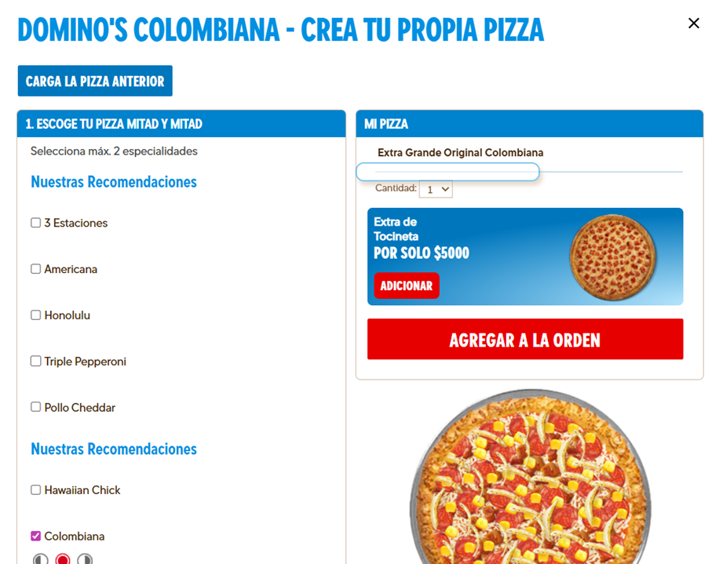
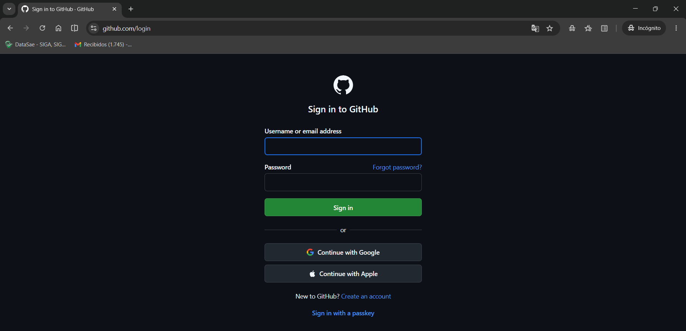
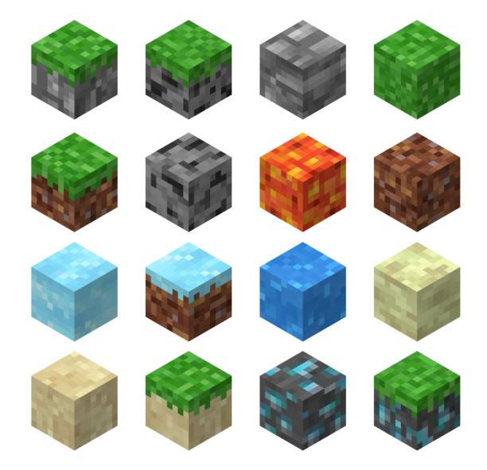
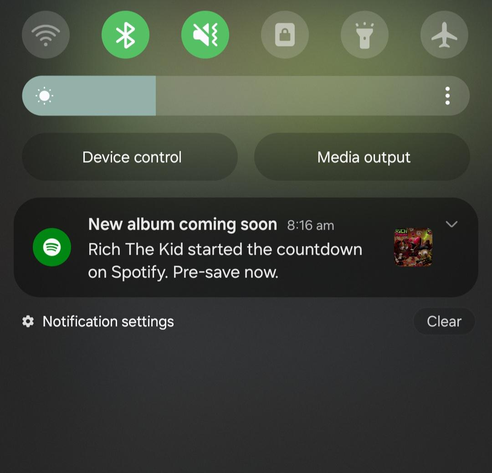
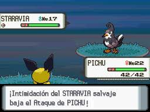

# 🎨 Design Patterns in Deno

¡Bienvenido a este proyecto de implementación de patrones de diseño utilizando **Deno**! Este repositorio contiene ejemplos prácticos y educativos de diversos patrones de diseño de software, organizados por categorías (creacionales, estructurales y comportamentales). Cada patrón está implementado en TypeScript y ejecutado en el entorno de Deno para demostrar su uso en aplicaciones modernas.

## 📋 Información del Proyecto

- **Lenguaje**: TypeScript
- **Entorno**: Deno
- **Versión de Deno recomendada**: 1.30.0 o superior
- **Propósito**: Educativo y demostrativo de patrones de diseño

## 👥 Integrantes del Grupo

- JORGE COBO  - 230222019
- DIANA LOPEZ - 230222003


## 🏗️ Lista de Patrones Utilizados

Los patrones de diseño están organizados en tres categorías principales según la clasificación de Gang of Four:

### 1. Creacionales (Creational Patterns)
- **Builder**: Construye objetos complejos paso a paso.
- **Factory Method**: Crea objetos sin especificar la clase exacta.
- **Singleton**: Garantiza una única instancia de una clase.

### 2. Estructurales (Structural Patterns)
- **Adapter**: Permite que interfaces incompatibles trabajen juntas.
- **Facade**: Proporciona una interfaz simplificada a un subsistema complejo.
- **Flyweight**: Comparte objetos para reducir el uso de memoria.

### 3. Comportamentales (Behavioral Patterns)
- **Command**: Encapsula una solicitud como un objeto.
- **Observer**: Define una dependencia uno-a-muchos entre objetos.
- **State**: Permite que un objeto cambie su comportamiento cuando cambia su estado interno.
- **Strategy**: Define una familia de algoritmos intercambiables.

## 📖 Breve Descripción de Cada Ejercicio

A continuación, se detalla cada patrón implementado, incluyendo una descripción breve, el propósito y cómo ejecutarlo.

### 1. Creacionales

#### 🏗️ Builder (`patterns/01-creational/builder.ts`)
**Descripción**: Implementa el patrón Builder para construir objetos complejos (como una pizza) de manera incremental, separando la construcción de la representación final.  
**Caso de uso en la vida real**: En una pizzería como Domino's, el Builder permite personalizar una pizza paso a paso: seleccionar tamaño, tipo de masa, salsa, queso extra e ingredientes, evitando constructores con muchos parámetros y haciendo el proceso claro y flexible.  
**Propósito**: Permite crear objetos con muchos parámetros opcionales sin sobrecargar el constructor.  
**Ejecución**: `deno run --allow-all patterns/01-creational/builder.ts`  


#### 🏭 Factory Method (`patterns/01-creational/factory-method.ts`)
**Descripción**: Define una interfaz para crear objetos, pero deja que las subclases decidan qué clase instanciar. Se usa para crear diferentes tipos de notificaciones (email, SMS, push).  
**Caso de uso en la vida real**: En plataformas de movilidad como Uber, el Factory Method permite crear diferentes tipos de transporte (UberX, Uber Black) según la categoría seleccionada, sin acoplar el sistema central a clases concretas de vehículos.  
**Propósito**: Proporciona flexibilidad en la creación de objetos sin acoplar el código cliente a clases concretas.  
**Ejecución**: `deno run --allow-all patterns/01-creational/factory-method.ts`

#### 🔒 Singleton (`patterns/01-creational/singleton.ts`)
**Descripción**: Asegura que una clase tenga solo una instancia y proporciona un punto de acceso global a ella. Implementado para un Logger que registra mensajes.  
**Caso de uso en la vida real**: En aplicaciones que requieren recursos compartidos como un pool de conexiones a base de datos (PostgreSQL, Redis), el Singleton garantiza una única instancia para toda la app, evitando duplicados y consumos innecesarios.  
**Propósito**: Controlar el acceso a recursos compartidos y garantizar consistencia en aplicaciones multi-hilo.  
**Ejecución**: `deno run --allow-all patterns/01-creational/singleton.ts`

### 2. Estructurales

#### 🔌 Adapter (`patterns/02-structural/adapter.ts`)
**Descripción**: Convierte la interfaz de una clase en otra interfaz que los clientes esperan. Se adapta un servicio de pago de terceros a una interfaz común.  
**Caso de uso en la vida real**: En aplicaciones de autenticación como GitHub login, el Adapter unifica interfaces incompatibles de proveedores (GitHub: signInWithToken(), Google: authenticate(), Apple: loginApple()) bajo un contrato común como login(credentials), permitiendo integrar múltiples servicios sin modificar el código cliente.  
**Propósito**: Permitir la colaboración entre clases con interfaces incompatibles sin modificar el código existente.  
**Ejecución**: `deno run --allow-all patterns/02-structural/adapter.ts`  


#### 🏛️ Facade (`patterns/02-structural/facade.ts`)
**Descripción**: Proporciona una interfaz unificada para un conjunto de interfaces en un subsistema. Simplifica el proceso de pedido de comida ocultando complejidades.  
**Caso de uso en la vida real**: En plataformas de despliegue como Vercel o Netlify, el Facade ofrece un simple botón "Deploy" que coordina múltiples subsistemas (clonar repo, compilar, aprovisionar servidor, configurar DNS), sin que el usuario conozca la complejidad interna.  
**Propósito**: Reducir la complejidad y mejorar la legibilidad al proporcionar una interfaz simple para subsistemas complejos.  
**Ejecución**: `deno run --allow-all patterns/02-structural/facade.ts`

#### 🪶 Flyweight (`patterns/02-structural/flyweight.ts`)
**Descripción**: Utiliza el compartir para apoyar eficientemente grandes cantidades de objetos finos. Se comparte información común entre partículas en un sistema de partículas.  
**Caso de uso en la vida real**: En videojuegos como Minecraft, el Flyweight comparte propiedades comunes de bloques (tipo, textura, color, dureza) y solo almacena datos únicos como posición, reduciendo enormemente el consumo de memoria para millones de bloques.  
**Propósito**: Minimizar el uso de memoria al compartir partes comunes de objetos en lugar de duplicar datos.  
**Ejecución**: `deno run --allow-all patterns/02-structural/flyweight.ts`  


### 3. Comportamentales

#### 📋 Command (`patterns/03-behavioral/command.ts`)
**Descripción**: Encapsula una solicitud como un objeto, permitiendo parametrizar clientes con colas, solicitudes y operaciones. Implementado para controlar un televisor con comandos de encendido/apagado.  
**Caso de uso en la vida real**: En sistemas de pedidos (e-commerce), el Command encapsula acciones como crear pedido, cancelar o marcar como enviado, permitiendo encolar solicitudes y desacoplar el menú de la lógica interna.  
**Propósito**: Desacoplar el objeto que invoca la operación del que la conoce, permitiendo operaciones undo/redo y colas de comandos.  
**Ejecución**: `deno run --allow-all patterns/03-behavioral/command.ts`

#### 👀 Observer (`patterns/03-behavioral/observer.ts`)
**Descripción**: Define una dependencia uno-a-muchos entre objetos para que cuando un objeto cambie de estado, todos sus dependientes sean notificados. Se usa para notificar suscriptores sobre cambios en un canal de YouTube.  
**Caso de uso en la vida real**: En plataformas como Spotify, el Observer permite que seguidores de artistas sean notificados automáticamente sobre nuevos lanzamientos (álbumes, canciones, conciertos), sin que el artista conozca detalles de cada seguidor.  
**Propósito**: Implementar sistemas de notificación push y mantener consistencia entre objetos relacionados.  
**Ejecución**: `deno run --allow-all patterns/03-behavioral/observer.ts`  


#### 🔄 State (`patterns/03-behavioral/state.ts`)
**Descripción**: Permite que un objeto altere su comportamiento cuando su estado interno cambia. Implementado para una máquina expendedora que cambia de estado según las acciones del usuario.  
**Caso de uso en la vida real**: En apps de movilidad como Uber, el State maneja el flujo de un viaje (solicitado, asignado conductor, en curso, finalizado o cancelado), cambiando comportamientos y transiciones sin condicionales largos.  
**Propósito**: Gestionar estados complejos y transiciones sin condicionales largos, mejorando la mantenibilidad.  
**Ejecución**: `deno run --allow-all patterns/03-behavioral/state.ts`

#### 🎯 Strategy (`patterns/03-behavioral/strategy.ts`)
**Descripción**: Define una familia de algoritmos, encapsula cada uno y los hace intercambiables. Se usa para diferentes estrategias de pago (tarjeta, PayPal, efectivo).  
**Caso de uso en la vida real**: En videojuegos como Pokémon, el Strategy permite cambiar dinámicamente estrategias de ataque (eléctrico, fuego, agua, planta) durante batallas, encapsulando cada algoritmo para evitar condicionales y facilitar agregar nuevos ataques.  
**Propósito**: Permitir cambiar algoritmos en tiempo de ejecución sin modificar el código cliente, promoviendo la reutilización.  
**Ejecución**: `deno run --allow-all patterns/03-behavioral/strategy.ts`  


## 🚀 Cómo Ejecutar el Proyecto

1. **Instalar Deno**: Asegúrate de tener Deno instalado. Visita [deno.land](https://deno.land) para instrucciones.

2. **Clonar el repositorio**:
   ```bash
   git clone <url-del-repositorio>
   cd design-patterns-deno
   ```

3. **Ejecutar un patrón específico**:
   ```bash
   deno run --allow-all patterns/XX-category/pattern-name.ts
   ```
   Reemplaza `XX-category` y `pattern-name.ts` con la ruta correspondiente.

4. **Ejecutar todos los patrones** (si hay un script principal, pero actualmente no existe `main.ts` en el repositorio).

## 🛠️ Dependencias y Helpers

- **Helpers incluidos**:
  - `helpers/colors.ts`: Utilidades para colorear la salida en consola usando códigos ANSI.
  - `helpers/sleep.ts`: Función para pausas asíncronas en las demostraciones.

- **Configuración**: El archivo `deno.json` define tareas y imports para facilitar la ejecución.

## 📚 Recursos Adicionales

- [Deno Documentation](https://deno.land/manual) - Guía oficial de Deno.
- [Refactoring Guru - Design Patterns](https://refactoring.guru/design-patterns) - Explicaciones detalladas con ejemplos.
.

---

*Proyecto desarrollado como parte del curso de Arquitectura de Software - Corte 3.*